# Unified Thinking Server - Architecture Diagrams

Visual representations of the system architecture, data flows, and component interactions.

---

## Table of Contents

1. [High-Level System Architecture](#high-level-system-architecture)
2. [MCP Protocol Communication Flow](#mcp-protocol-communication-flow)
3. [Storage Architecture](#storage-architecture)
4. [Thinking Modes Architecture](#thinking-modes-architecture)
5. [Tool Organization](#tool-organization)
6. [Data Flow Diagrams](#data-flow-diagrams)
7. [Integration Patterns](#integration-patterns)

---

## High-Level System Architecture

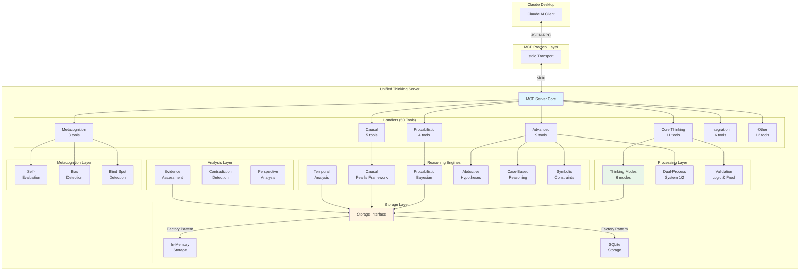

---

## MCP Protocol Communication Flow

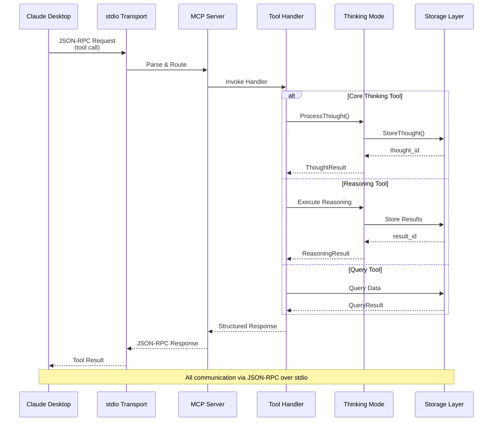

---

## Storage Architecture

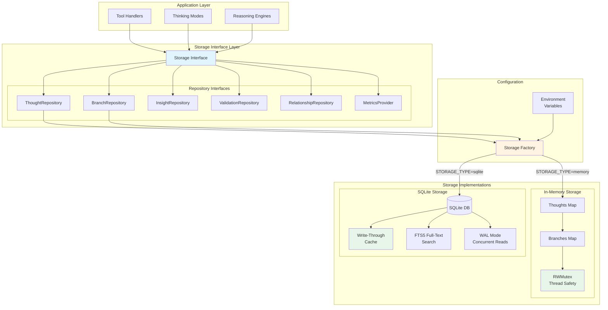

### Storage Factory Pattern

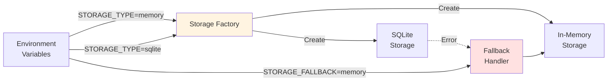

---

## Thinking Modes Architecture

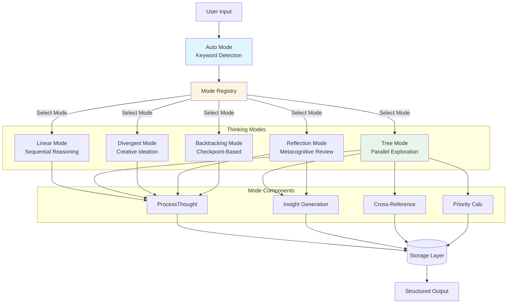

### Auto Mode Selection Logic

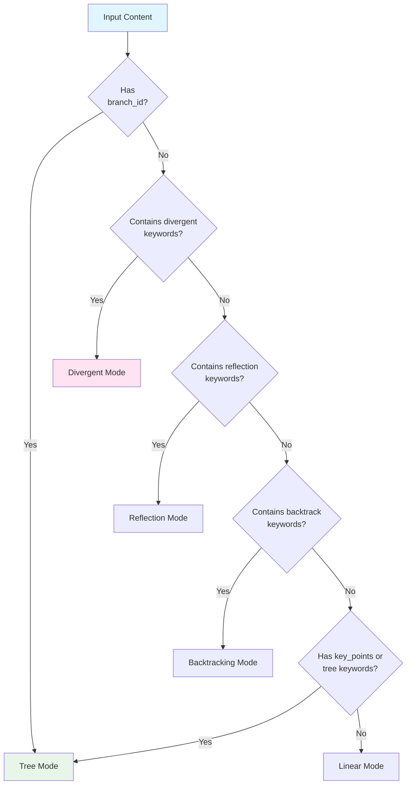

---

## Tool Organization

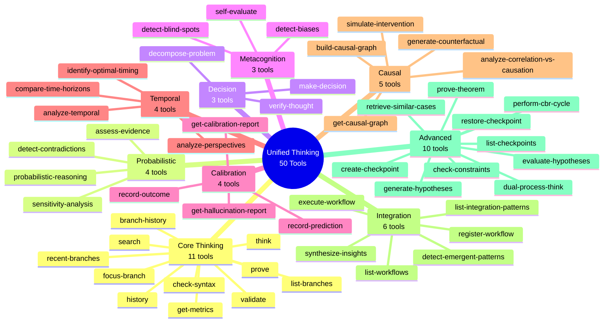

---

## Data Flow Diagrams

### Think Tool Data Flow

```mermaid
flowchart LR
    Input[User Request]
    AutoMode[Auto Mode<br/>Selection]
    ModeExec[Mode<br/>Execution]

    subgraph "Processing"
        Parse[Parse Content]
        Analyze[Analyze<br/>Complexity]
        Generate[Generate<br/>Thought]
    end

    subgraph "Storage Operations"
        Store[Store Thought]
        UpdateBranch[Update Branch<br/>if Tree Mode]
        GenInsights[Generate<br/>Insights]
    end

    subgraph "Validation"
        AutoVal[Auto-Validation<br/>if confidence < 0.5]
        Quality[Quality<br/>Assessment]
    end

    subgraph "Response Generation"
        Metadata[Generate<br/>Metadata]
        Suggestions[Next Tool<br/>Suggestions]
        Export[Export<br/>Formats]
    end

    Output[JSON Response]

    Input --> AutoMode
    AutoMode --> ModeExec
    ModeExec --> Parse
    Parse --> Analyze
    Analyze --> Generate

    Generate --> Store
    Store --> UpdateBranch
    UpdateBranch --> GenInsights

    GenInsights --> AutoVal
    AutoVal --> Quality

    Quality --> Metadata
    Metadata --> Suggestions
    Suggestions --> Export

    Export --> Output

    style AutoMode fill:#e1f5ff
    style AutoVal fill:#fff4e1
    style Output fill:#e8f5e9
```

### Probabilistic Reasoning Data Flow

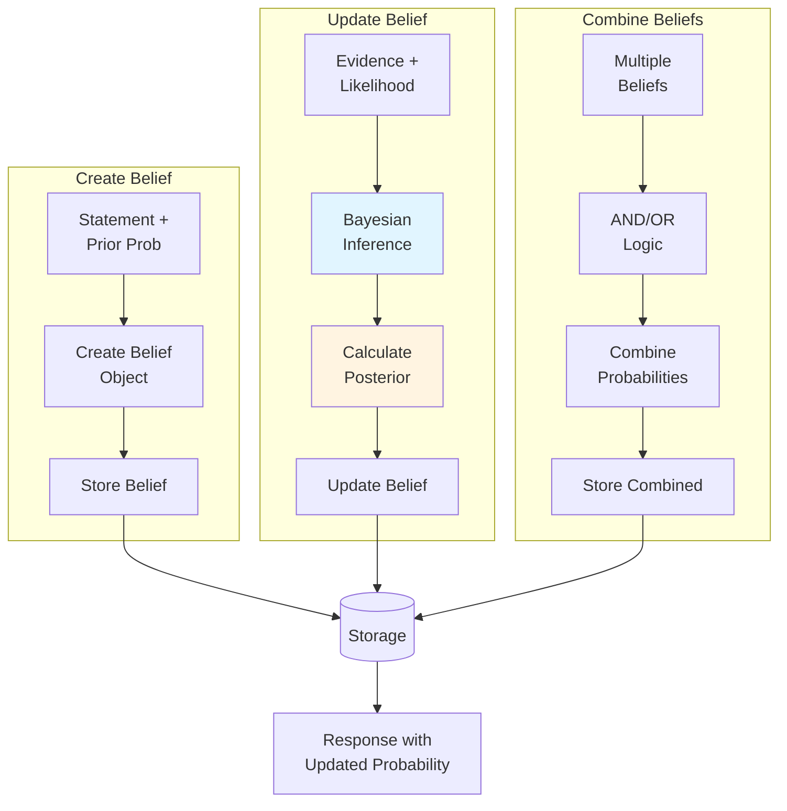

### Causal Reasoning Data Flow

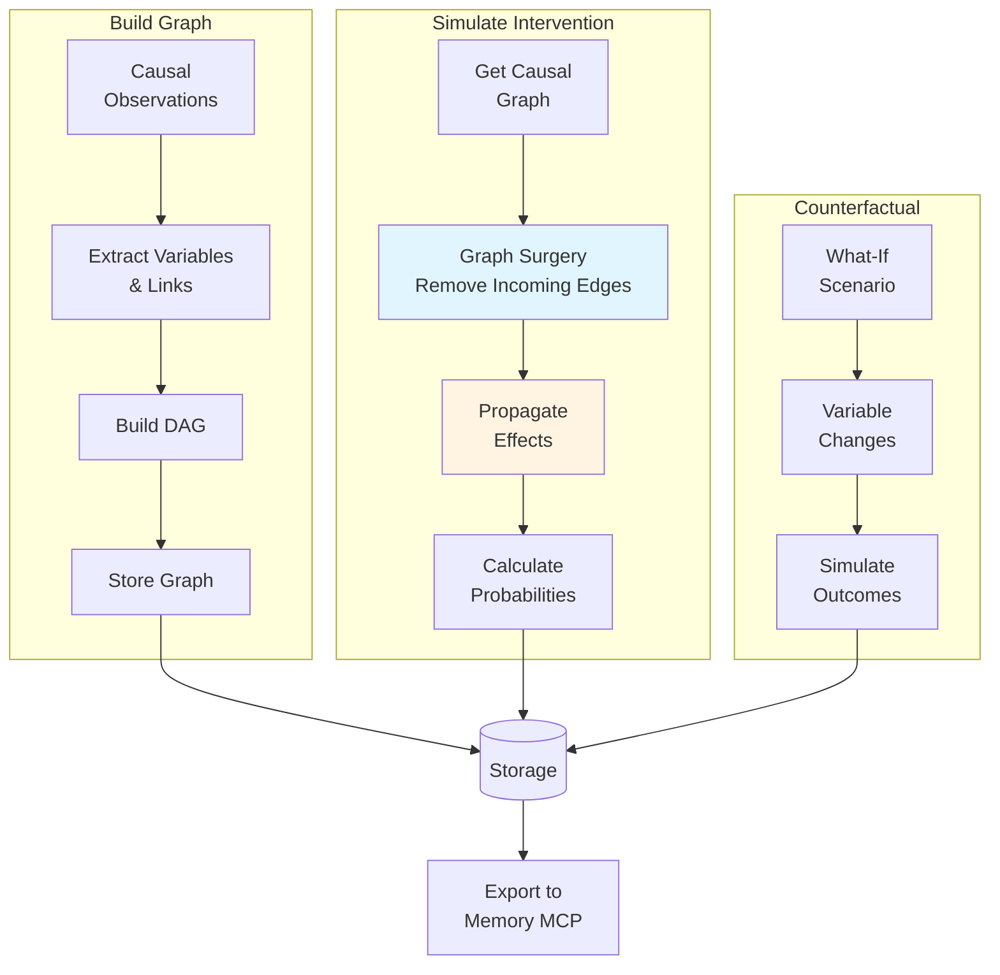

---

## Integration Patterns

### Research-Enhanced Thinking Pattern

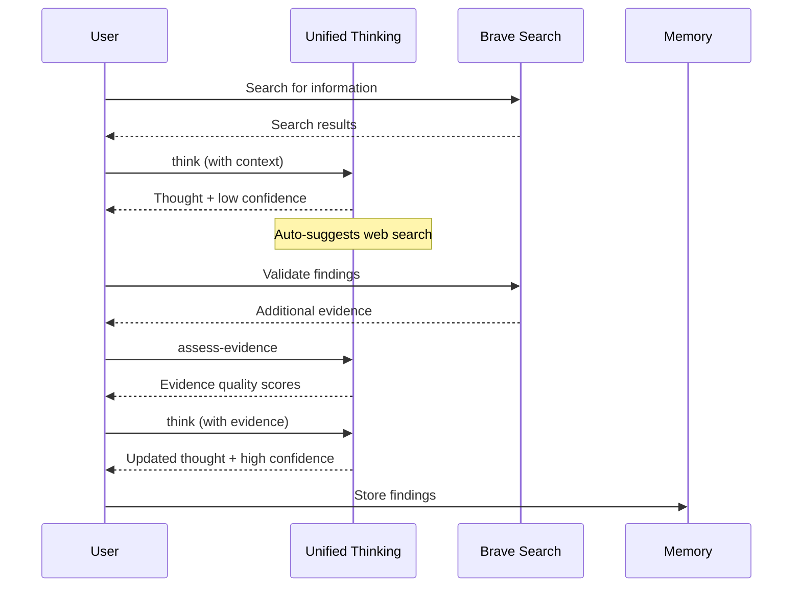

### Knowledge-Backed Decision Making Pattern

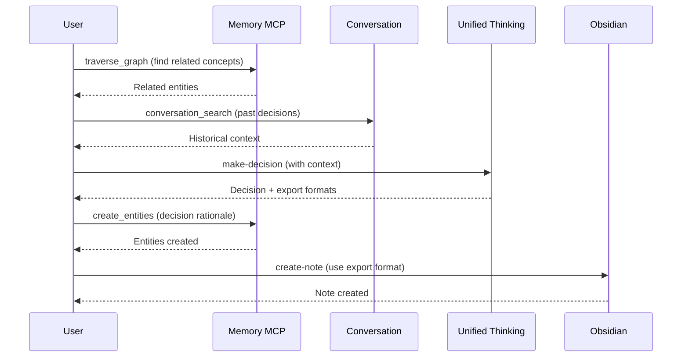

### Causal Model to Knowledge Graph Pattern

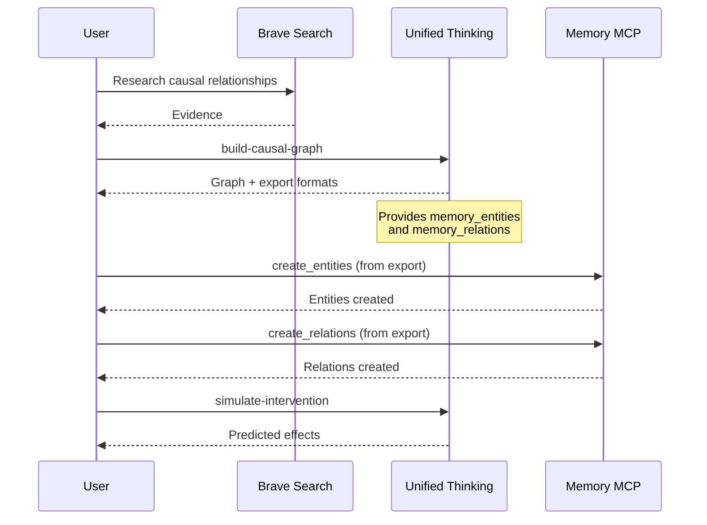

---

## Component Interaction Matrix

```
┌─────────────────────────────────────────────────────────────────┐
│                    Component Interactions                       │
├──────────────┬────────┬────────┬────────┬────────┬─────────────┤
│  Component   │ Modes  │ Storage│Validate│Reasoning│  Analysis  │
├──────────────┼────────┼────────┼────────┼────────┼─────────────┤
│ Handlers     │   ✓    │   ✓    │   ✓    │   ✓    │     ✓      │
│ Modes        │   -    │   ✓    │   ✓    │   -    │     -      │
│ Storage      │   -    │   -    │   -    │   -    │     -      │
│ Validation   │   -    │   ✓    │   -    │   -    │     ✓      │
│ Reasoning    │   -    │   ✓    │   ✓    │   -    │     ✓      │
│ Analysis     │   -    │   ✓    │   ✓    │   ✓    │     -      │
│ Metacognition│   -    │   ✓    │   ✓    │   -    │     ✓      │
│ Integration  │   ✓    │   ✓    │   -    │   ✓    │     ✓      │
└──────────────┴────────┴────────┴────────┴────────┴─────────────┘

Legend:
  ✓ = Direct dependency/interaction
  - = No direct interaction
```

---

## Package Dependencies

```
unified-thinking/
│
├── cmd/server (main entry point)
│   └── depends on: server, storage, orchestration
│
├── internal/types (core data structures)
│   └── no dependencies (foundation package)
│
├── internal/storage (storage layer)
│   └── depends on: types
│
├── internal/modes (thinking modes)
│   └── depends on: types, storage
│
├── internal/processing (dual-process)
│   └── depends on: types, storage, modes
│
├── internal/reasoning (probabilistic, causal, etc.)
│   └── depends on: types, storage
│
├── internal/analysis (evidence, contradiction, etc.)
│   └── depends on: types, storage, reasoning
│
├── internal/metacognition (self-eval, biases)
│   └── depends on: types, storage, validation
│
├── internal/validation (logic, proofs)
│   └── depends on: types, storage
│
├── internal/integration (synthesis, patterns)
│   └── depends on: types, storage, modes, reasoning
│
├── internal/orchestration (workflows)
│   └── depends on: types, all reasoning packages
│
└── internal/server (MCP server & handlers)
    └── depends on: all packages
```

---

## Thread Safety Model

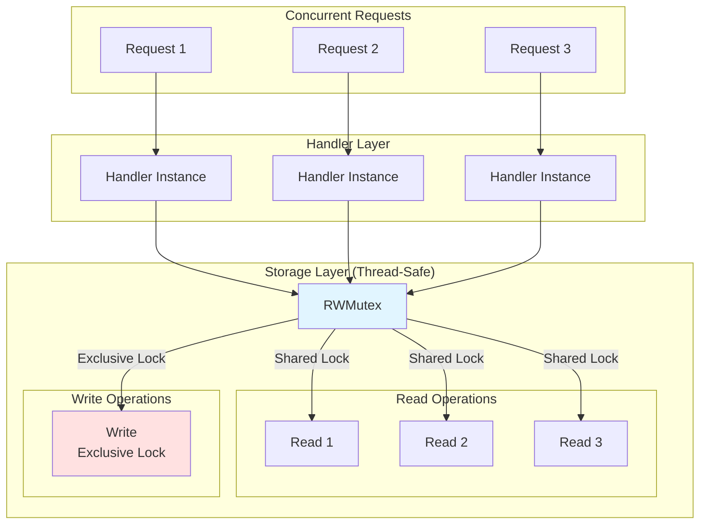

---

## Performance Characteristics

```
┌─────────────────────────────────────────────────────────────┐
│              Operation Performance Profile                   │
├────────────────────────┬──────────┬─────────┬───────────────┤
│      Operation         │ In-Memory│ SQLite  │  Complexity   │
├────────────────────────┼──────────┼─────────┼───────────────┤
│ Store Thought          │  < 1ms   │ 1-5ms   │    O(1)       │
│ Get Thought            │  < 1ms   │ < 1ms   │    O(1)       │
│ Search Thoughts        │  1-10ms  │ 5-20ms  │    O(n)       │
│ List Branches          │  < 1ms   │ 1-3ms   │    O(b)       │
│ Validate Thought       │  1-5ms   │ 1-5ms   │    O(n)       │
│ Build Causal Graph     │  5-20ms  │ 10-30ms │    O(v+e)     │
│ Simulate Intervention  │  10-50ms │ 20-60ms │    O(v+e)     │
│ Synthesize Insights    │  20-100ms│ 30-120ms│    O(n²)      │
│ Detect Contradictions  │  10-50ms │ 15-60ms │    O(n²)      │
└────────────────────────┴──────────┴─────────┴───────────────┘

Legend:
  n = number of thoughts
  b = number of branches
  v = number of variables in graph
  e = number of edges in graph
```

---

## Deployment Architecture

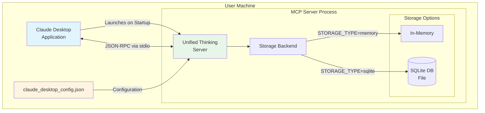

---

## Error Handling Flow

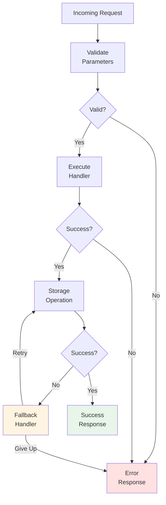

---

## Resource Management

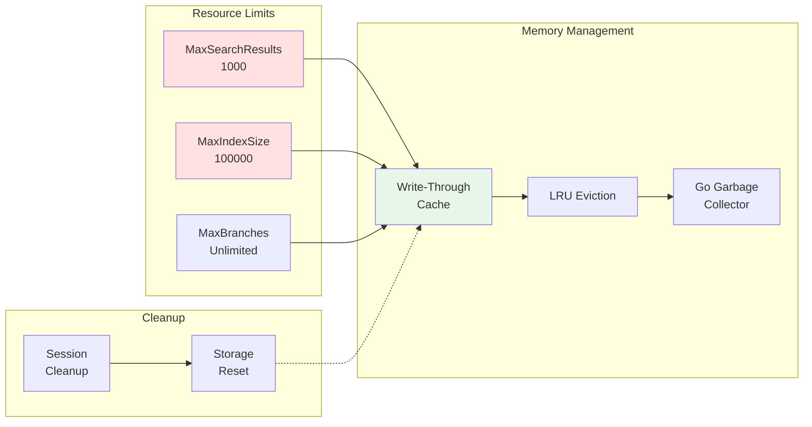

---

## Summary

### Key Architectural Principles

1. **Modular Design**: Clear separation of concerns across 15 packages
2. **Interface-Based**: Storage and reasoning components use interfaces for testability
3. **Thread-Safe**: RWMutex protection for concurrent access
4. **Pluggable Storage**: Factory pattern enables multiple storage backends
5. **MCP Protocol**: Standard JSON-RPC communication via stdio transport
6. **Resource-Conscious**: Limits and caching prevent resource exhaustion
7. **Extensible**: Mode registry and tool registration support additions
8. **Metadata-Driven**: Rich metadata guides tool usage and integration

### Performance Optimizations

- **Write-through caching** for SQLite performance
- **FTS5 full-text search** for fast queries
- **WAL mode** for concurrent database reads
- **Prepared statements** for SQL efficiency
- **Deep copy strategy** prevents data races
- **Resource limits** prevent DoS attacks

### Production Readiness

- Comprehensive test coverage (75% overall, 81.2% handlers)
- Thread-safe concurrent operations
- Graceful error handling and fallbacks
- Resource limits and DoS protection
- Multiple storage backends (memory + SQLite)
- Extensive validation and quality checks

---

**For More Information**:
- [API Reference](API_REFERENCE.md) - Complete tool documentation
- [Project Index](PROJECT_INDEX.md) - Project structure and components
- [Integration Test Report](MCP_INTEGRATION_TEST_REPORT.md) - End-to-end validation
- [README](README.md) - Quick start and configuration
